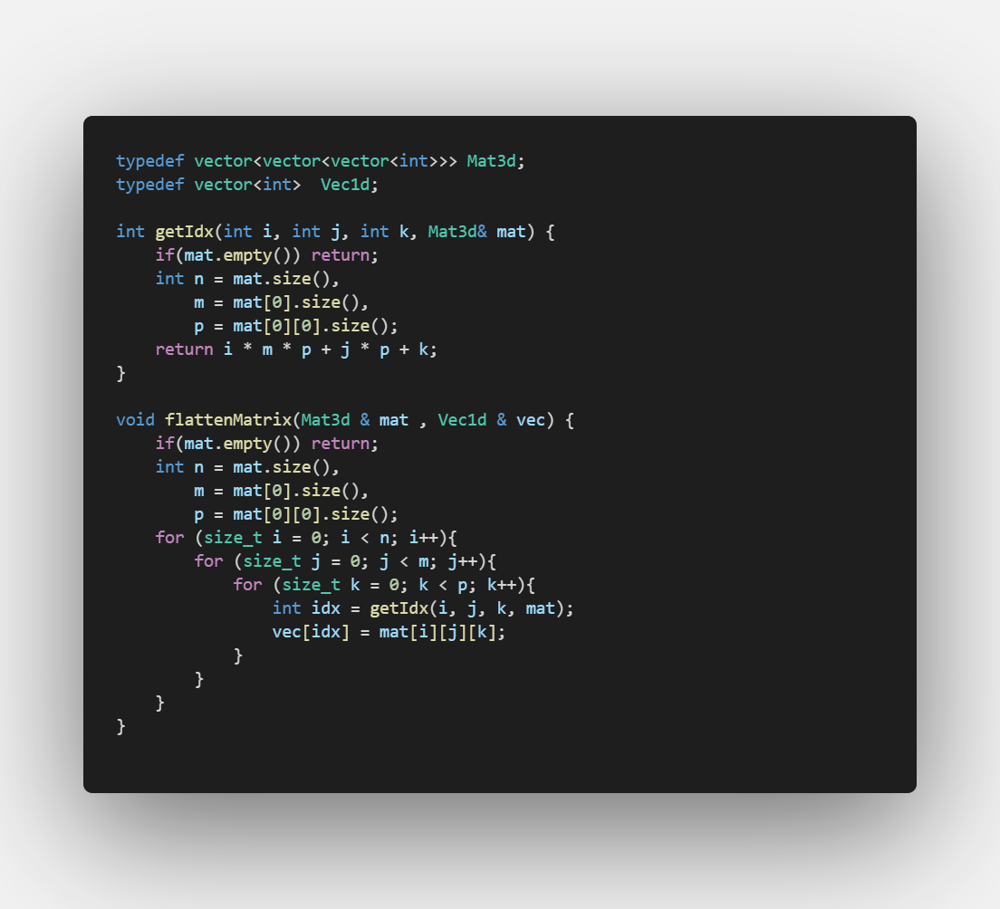
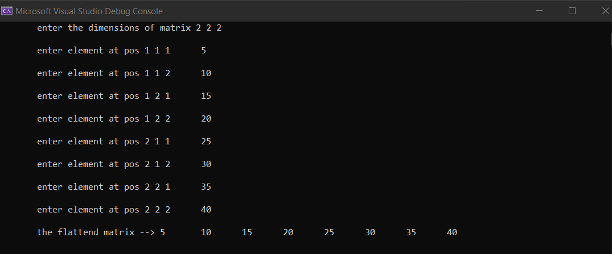

# Matrix-Flatten

Master micro task for summer intern : task3 Flattening matrix

## 🏁 Get Started <a name = "Install"></a>

```
https://github.com/omar214/Matrix-Flatten.git
```

```
cd Matrix-Flatten
```

```
gcc source.cpp -o output.exe
```

```
output 
```

## 💻 Built Using <a name = "tech"></a>

- **C++**
  
  ## ✨ Complexity

- *The complexity of converting idx is O(1)*

## 📷 Screenshots

<div name="Screenshots" align="center">                     
 </a> 
 <hr>                                                        
 </a> 
 <hr>                                                        
 </a> 
 <hr>                                                        
 </div>
